# Solar Node by Bruce

A weather-resistant, solar-powered off-grid [Meshtastic](https://meshtastic.org/) relay node built with Seeed Studio hardware and recycled components.

---

## Hardware Components

| Component | Description |
| :--- | :--- |
| **MCU Board** | [Seeed Studio XIAO nRF52840](https://www.seeedstudio.com/XIAO-nRF52840-Wio-SX1262-Kit-for-Meshtastic-p-6400.html) |
| **LoRa Module** | [Seeed Studio Wio-SX1262](https://www.seeedstudio.com/XIAO-nRF52840-Wio-SX1262-Kit-for-Meshtastic-p-6400.html) |
| **Antenna** | [868 MHz Whip Antenna](https://www.smartcasa.co.za/products/868mhz-whip-antenna) |
| **Pigtail** | [IPEX to SMA Waterproof Pigtail](https://www.smartcasa.co.za/products/ipex-to-sma-pigtail-waterproof) |
| **Solar Charger** | [CN3065 Mini Solar Charge Controller](https://www.robotics.org.za/CN3065?search=CN3065) |
| **Solar Panel** | 5V panel harvested from a donor garden solar light |
| **Power** | Rechargeable Battery + Holder |
| **Enclosure** | ENL120705P Weatherproof Box |

---

## Build Overview

### Core Architecture & Connections
* **LoRa Communication:** The XIAO nRF52840 paired with the Wio-SX1262 module serves as the core Meshtastic node. The 868 MHz whip antenna connects via an IPEX-to-SMA waterproof pigtail to ensure outdoor durability.
* **Harvested Solar Power:** A 5V panel harvested from a donor solar light feeds the CN3065 solar charge module to safely maintain battery levels.
* **Solid Reliability:** All internal wiring was soldered directly to pads and components rather than crimped to avoid vibration or corrosion disconnects in the field.

### Software & Firmware
* Flashed with the latest compatible Meshtastic firmware via the official [Meshtastic Web Flasher](https://flasher.meshtastic.org/).

---

## Build Walkthrough

### 1. Electronics & Antenna Prep

 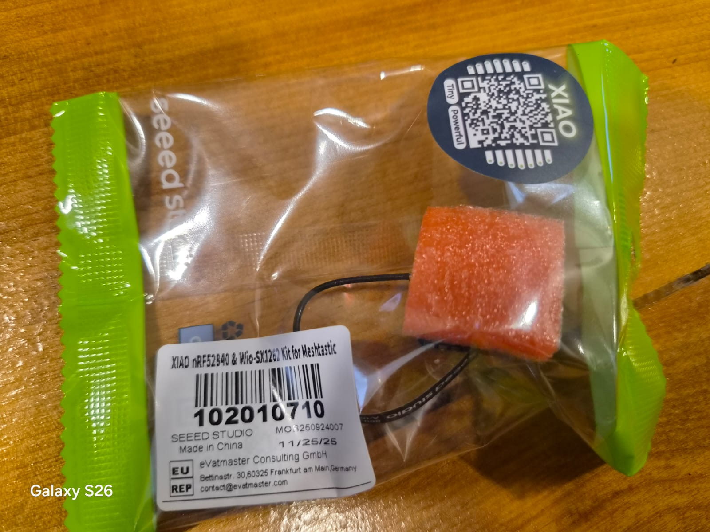
  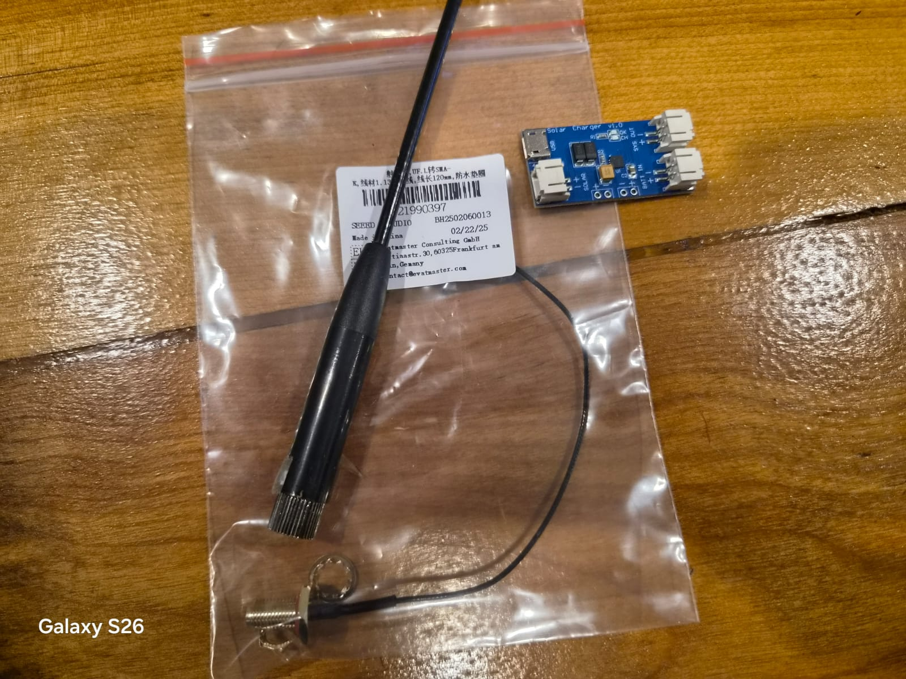
  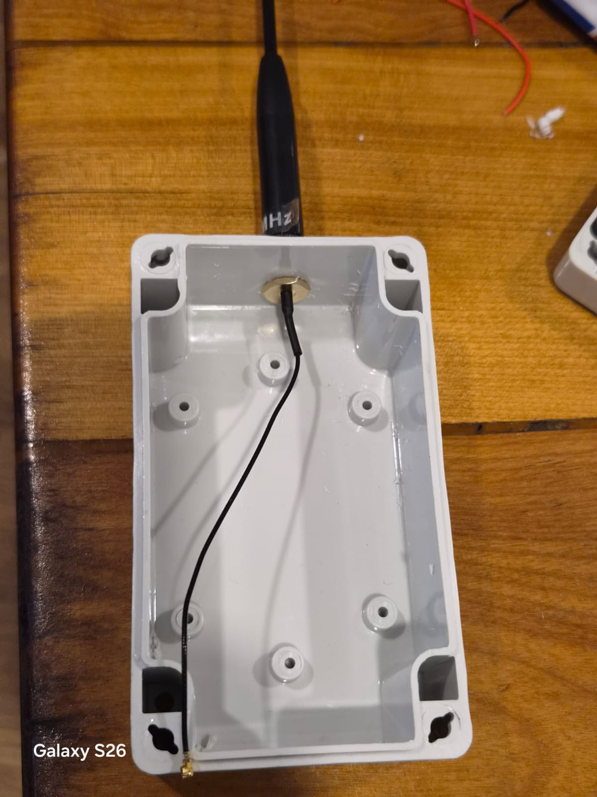 

* The XIAO nRF52840 and Wio-SX1262 core assembly.
* Preparing the 868MHz whip antenna, SMA pigtail, and CN3065 charge board.
* SMA pigtail mounted securely into the enclosure wall.

---

### 2. Solar Panel Harvesting

  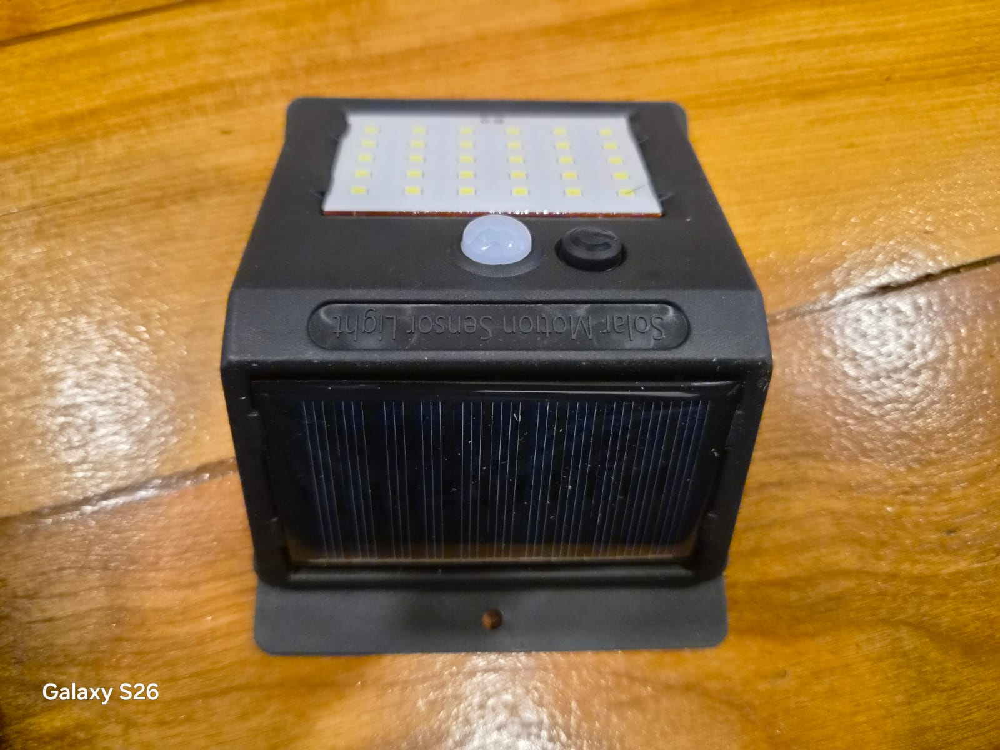
  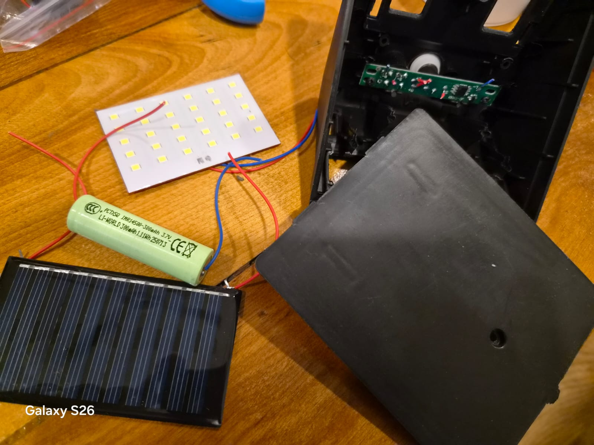
  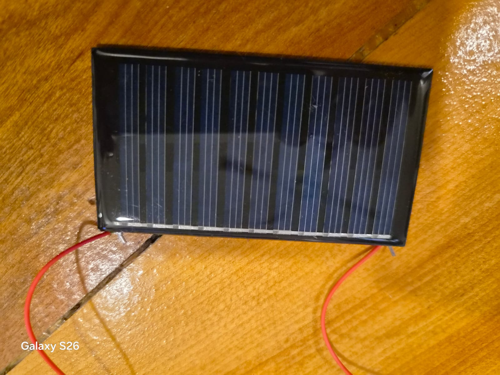

* Donor garden light harvested for panel.
* Fully dismantled to extract the internal 5V solar panel and wire leads.

---

### 3. Enclosure & Panel Mounting

  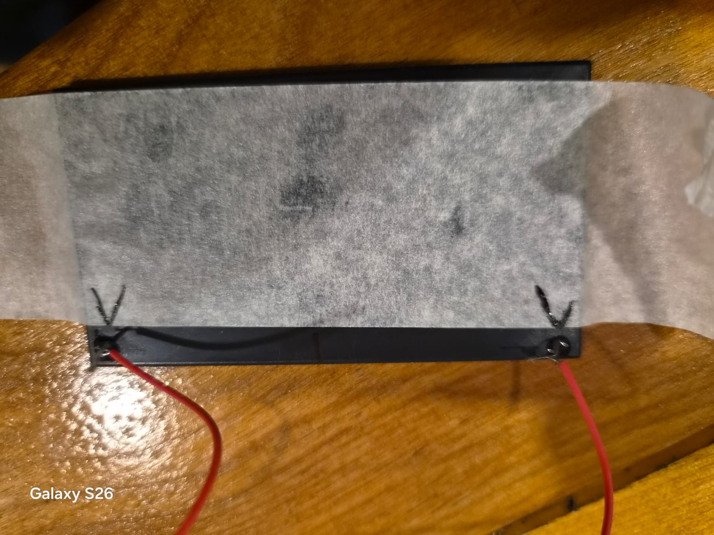
  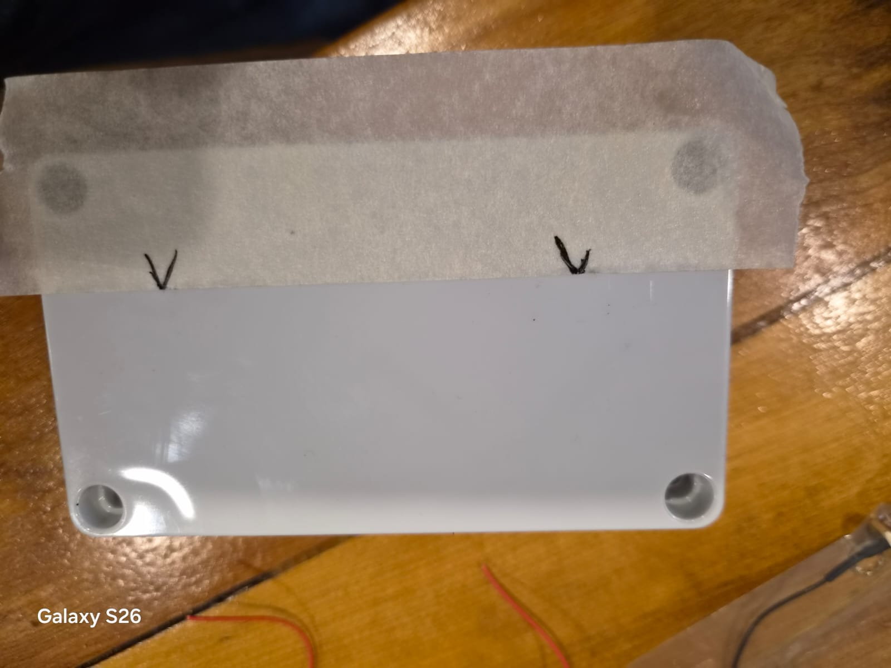
  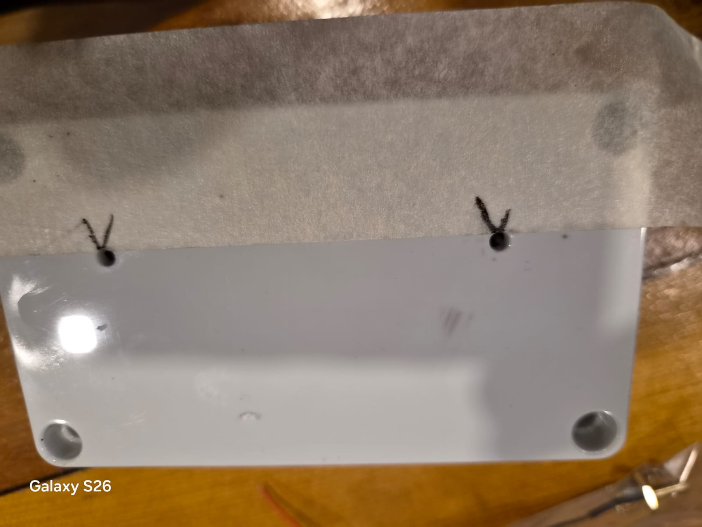
  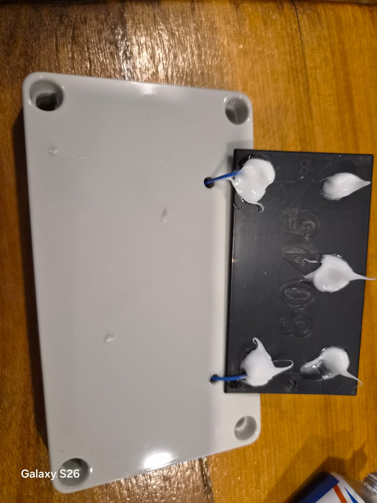

1. Used masking tape to mark out hole spacing accurately.
2. Transferred hole measurements directly onto the ENL120705P box lid.
3. Drilled wire passthrough and mounting holes.
4. Sealed thoroughly around the drilled holes with outdoor silicone adhesive before securing the panel.

---

### 4. Wiring & Internal Layout

  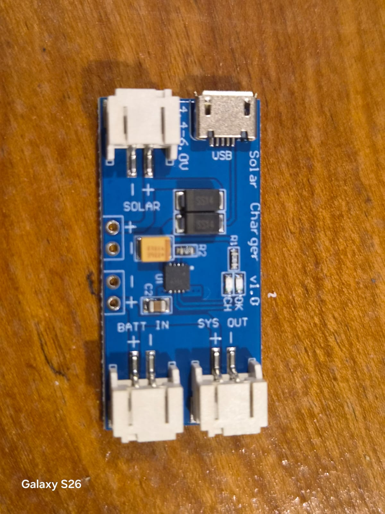
  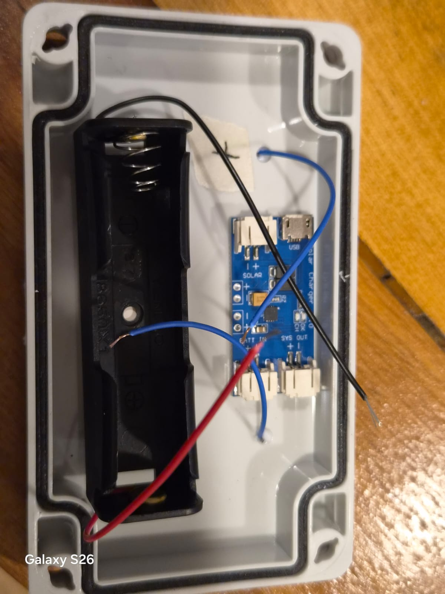
  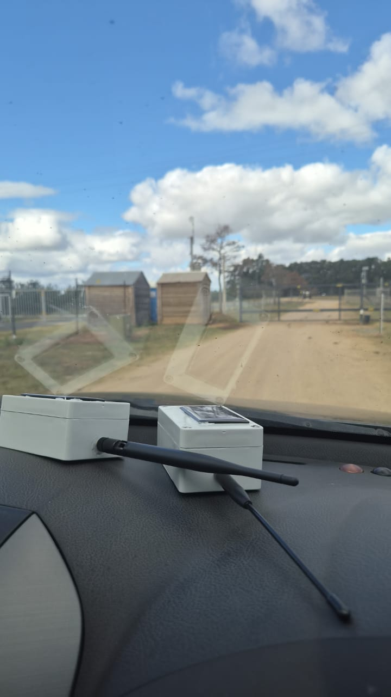

* Direct soldering to the CN3065 charger pads for maximum connection reliability.
* Component placement inside the enclosure secured using heavy-duty double-sided Velcro.
* The fully assembled off-grid solar node ready for outdoor deployment!